# NeteaseCloudMusic Player

基于网易云 API 接口实现的 Android 音乐播放器

## 功能预览

### 主界面

| 首页 | 发现 | 推荐 |
|:---:|:---:|:---:|
| 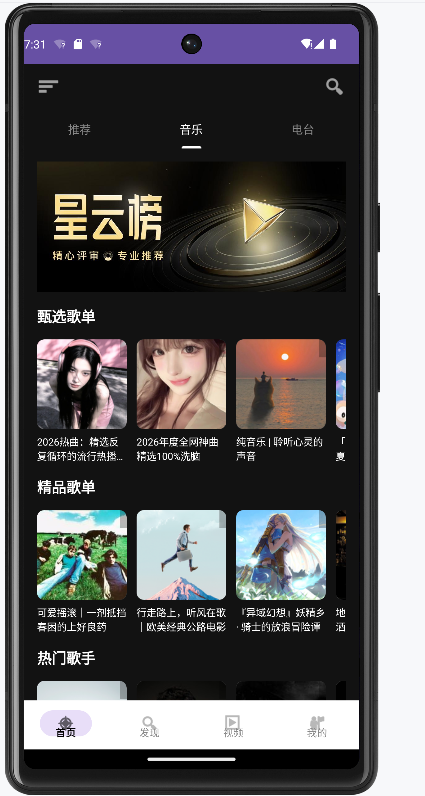 | 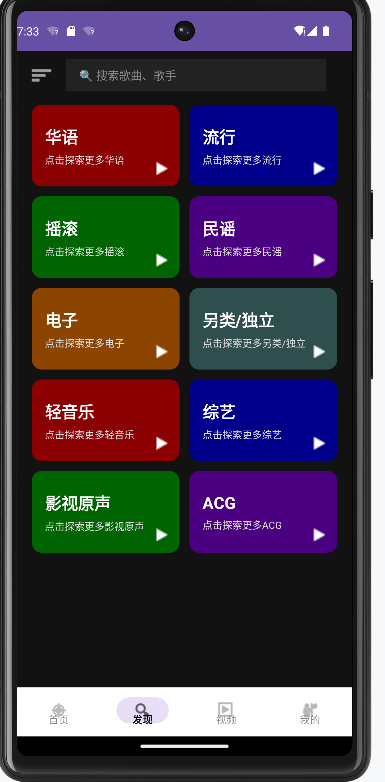 | 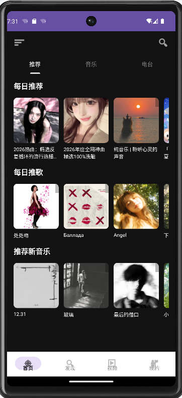 |

| 发现页华语歌单 | 歌手榜 | 主播新人榜 |
|:---:|:---:|:---:|
|  | 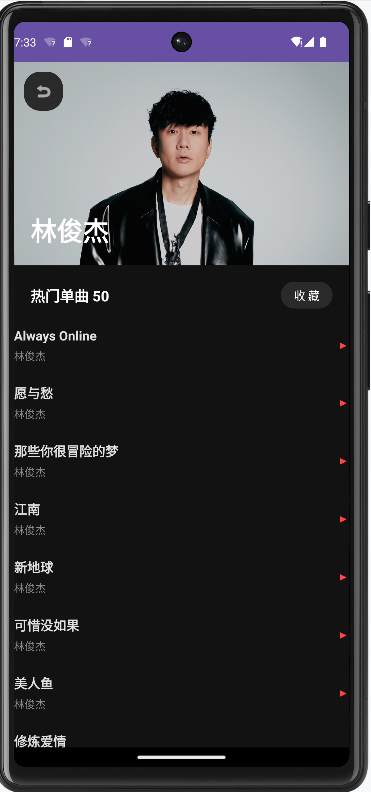 | 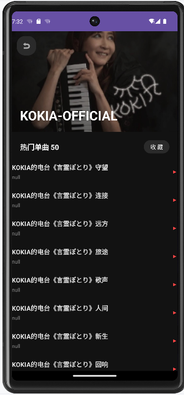 |

| MV | MV 可播放 | 电台 |
|:---:|:---:|:---:|
| 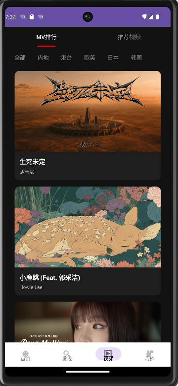 | 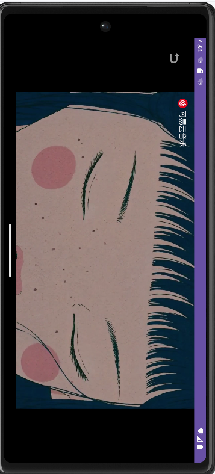 | 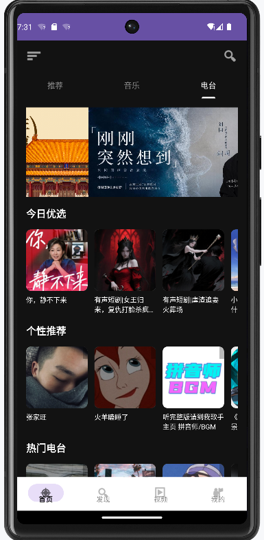 |

### 登录

| 登录界面 | 二维码登录 |
|:---:|:---:|
| 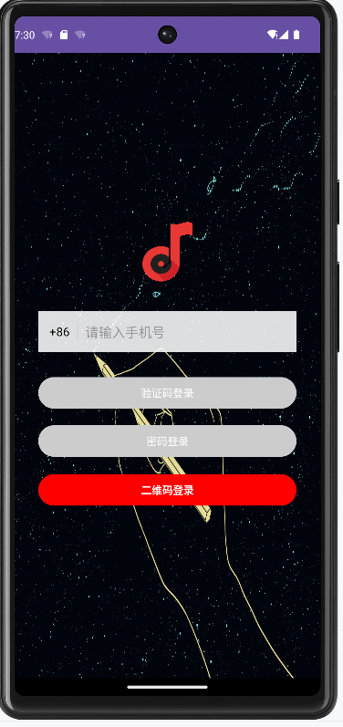 | 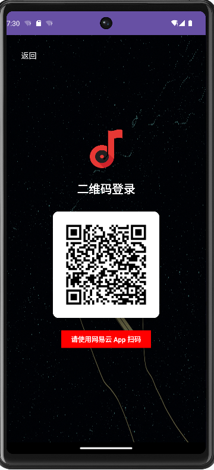 |

登录采用二维码登录，同时支持密码和验证码登录。由于在模拟器运行，没有设备码，无法正确登录，会显示账号有风险。设置了登录持久化，避免频繁登录造成账号封禁。

### 播放 & 歌单

| 当前歌单播放队列 | 歌单收藏 | 收藏的歌单 |
|:---:|:---:|:---:|
| 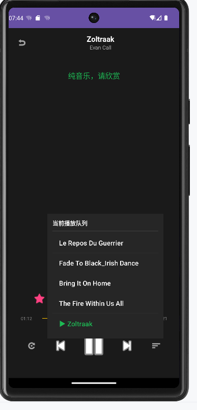 | 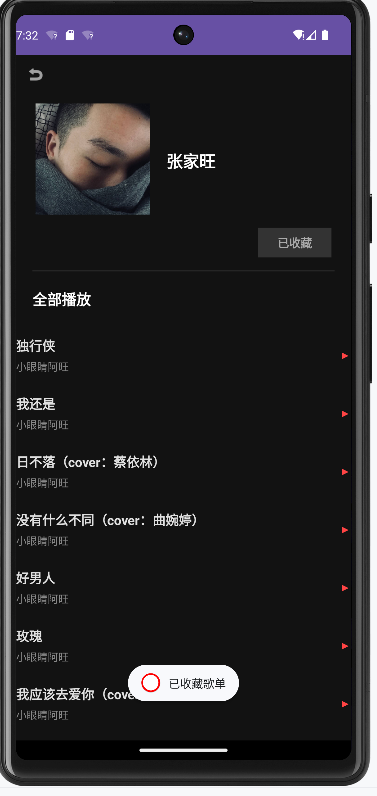 | 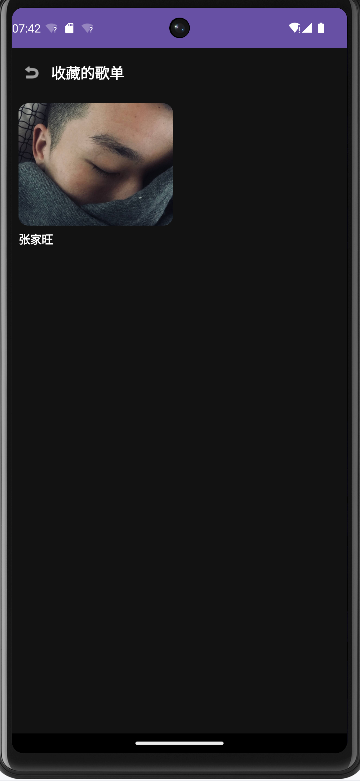 |

| 创建本地歌单 | 成功创建本地歌单 | 加号加入歌单 |
|:---:|:---:|:---:|
| 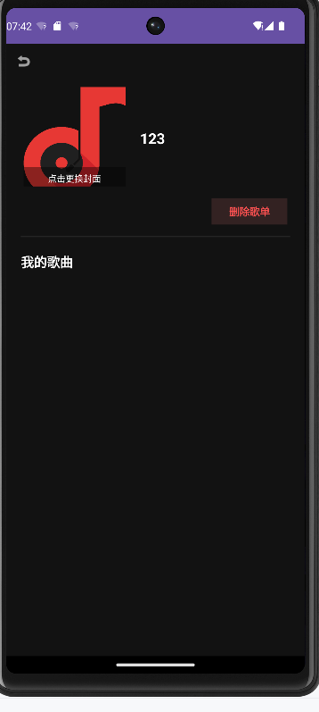 | 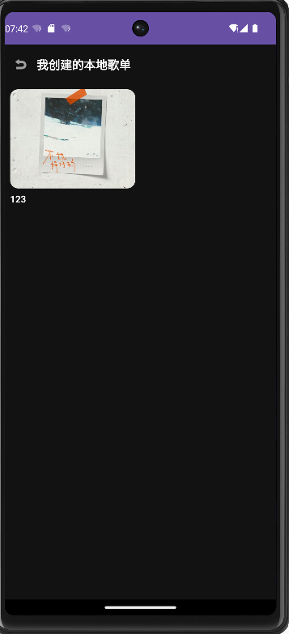 | 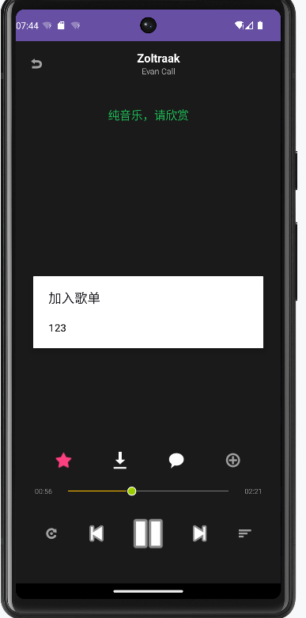 |

### 歌曲操作

| 歌曲评论 | 喜欢的歌曲 | 我喜欢的音乐 |
|:---:|:---:|:---:|
| 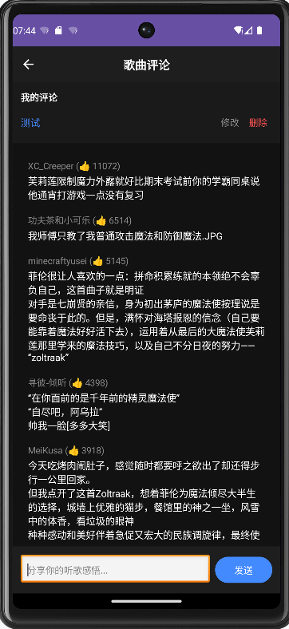 | 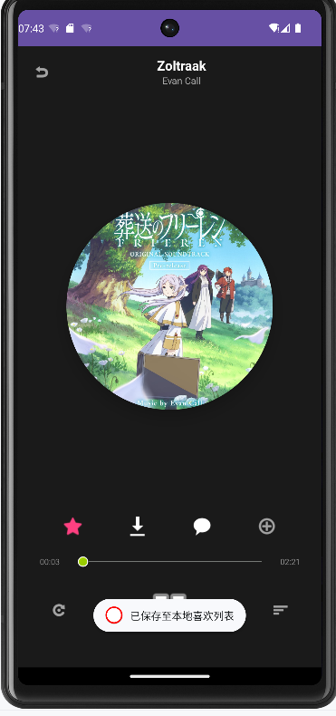 | 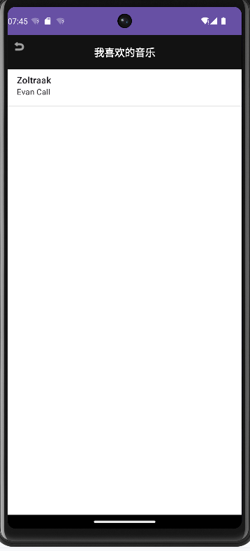 |

| 可以正常下载 | 上传内容 | 搜索 |
|:---:|:---:|:---:|
| 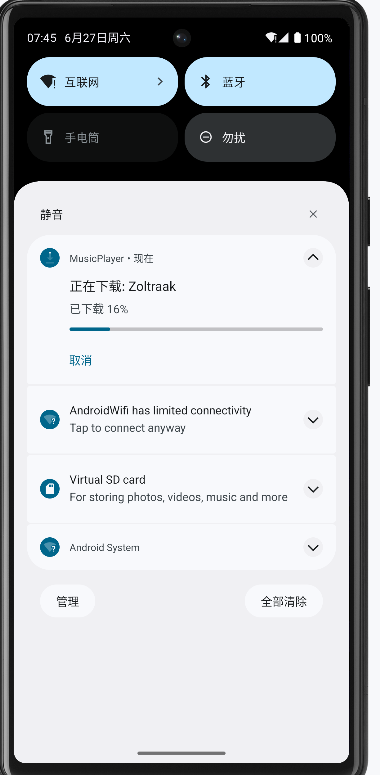 | 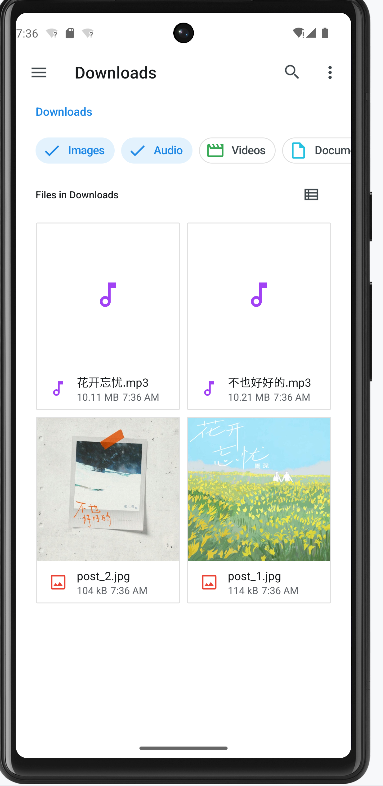 | 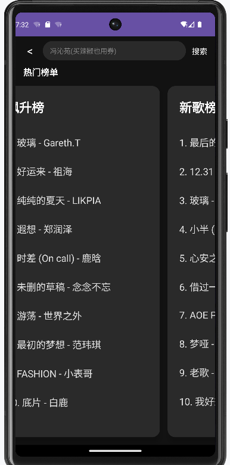 |

### 个人中心

| 我的部分 | 最近播放 | 本地音乐 |
|:---:|:---:|:---:|
| 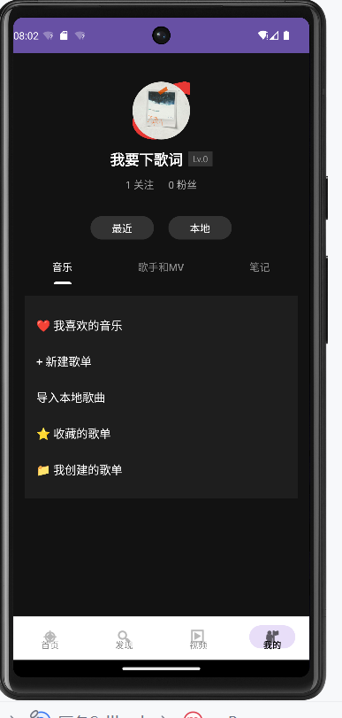 | 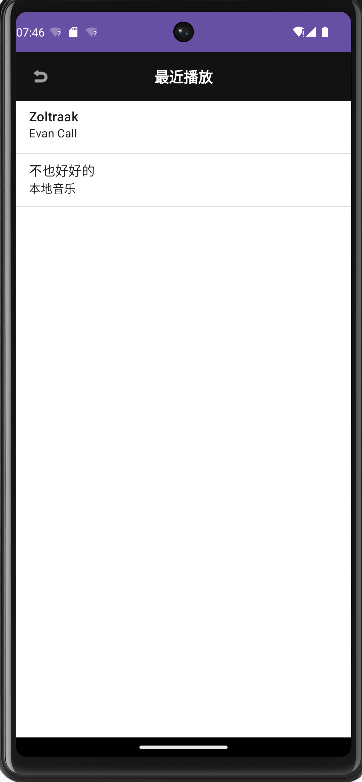 | 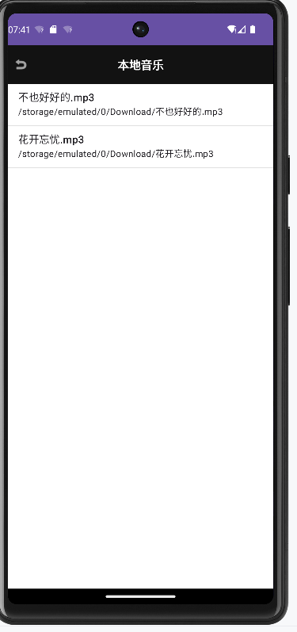 |

| 更换头像 | 头像已更新 | 关注粉丝 |
|:---:|:---:|:---:|
| 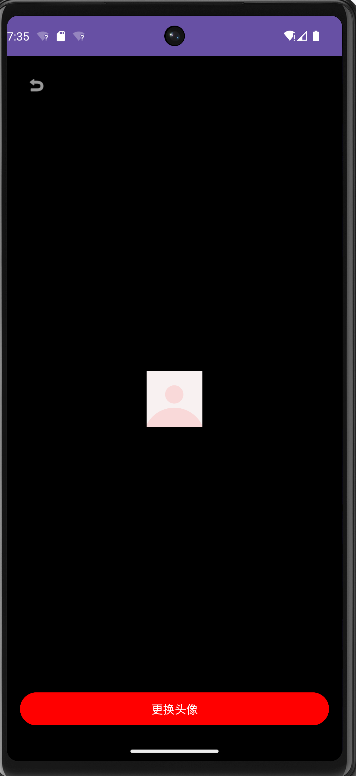 | 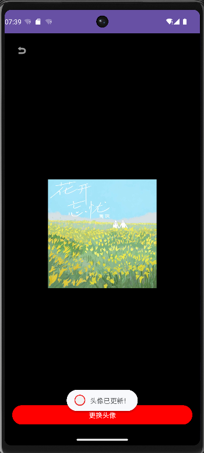 | 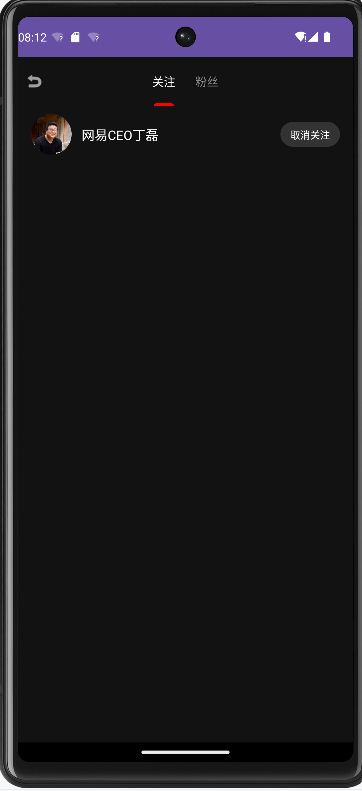 |

| 设置页面 | 笔记 |
|:---:|:---:|
| 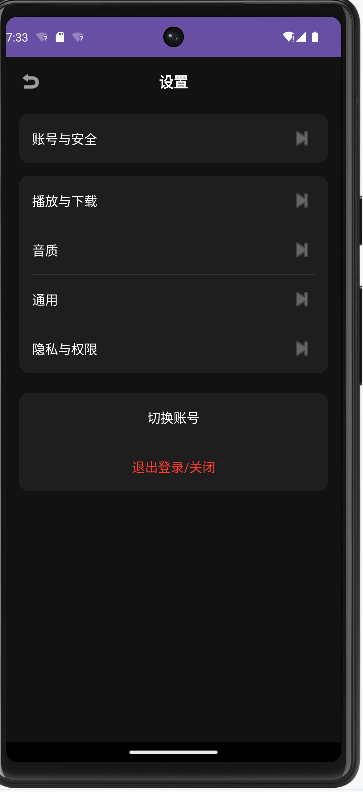 | 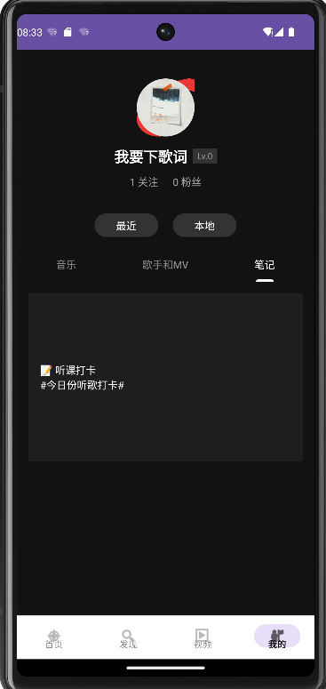 |

## 技术栈

- **前端**: Android (Fragment 架构)
- **后端**: [NeteaseCloudMusicApi (api-enhanced-main)](https://github.com/your-repo/api-enhanced-main)

## 后端部署

使用 GitHub 开源项目 `NeteaseCloudMusicApi` 获取 API 接口：

```bash
# 1. 进入项目目录
cd E:\APP\music\springapi\NeteaseCloudMusicApi\api-enhanced-main\api-enhanced-main

# 2. 安装依赖（第一次运行必须执行）
npm install

# 3. 启动服务
node app.js
```

## 项目结构

- `首页` - 推荐、音乐、电台
- `发现` - 各种类别，华语、摇滚等
- `视频` - MV
- `我的` - 个人中心、本地歌单、收藏

- 搜索、设置
